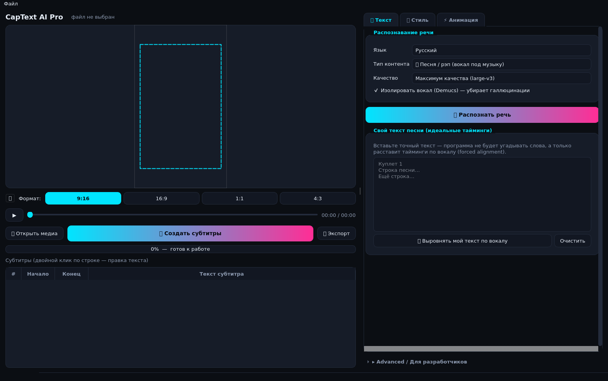

# CapText AI Pro

Десктопное приложение (macOS / Windows / Linux) для автоматической генерации **кинетических субтитров**
к песням, рэпу и подкастам. Интерфейс в духе CapCut/Submagic: пресеты вместо формул.

`pytest` — **57/57 зелёных**.




## Что исправлено в v3

**1. Плеер на macOS (Apple Silicon).** `app/ui/player.py` переписан: цепочка бэкендов с
автооткатом — `QVideoSink` + собственная отрисовка кадра (самый предсказуемый путь на M1/M2/M3)
→ `QVideoWidget` → `QGraphicsView`+`QGraphicsVideoItem` → покадровый предпросмотр через PyAV,
если QtMultimedia не загрузился вообще. `configure_media_backend()` вызывается в `main.py`
**до** создания `QApplication` и ставит `QT_MEDIA_BACKEND=darwin` (AVFoundation) на macOS.
Оверлей субтитров лежит поверх видео в `QStackedLayout(StackAll)` и рисуется 60 FPS,
Smart Contrast подхватывает реальный кадр из `current_video_image()`.
Порядок можно форсировать: `CAPTEXT_PLAYER=sink|widget|graphics|frames`.

**2. Галлюцинации на интро («Песня «Музыка»» на 0:00–0:30).** `app/core/asr_engine.py`:
* VAD **до** модели — Silero (`vad_threshold=0.35`) с энергетическим фолбэком; вычисляется
  `first_vocal_onset` — первая фактическая вспышка вокала;
* `drop_intro_hallucinations()` удаляет всё, что «услышано» до этого момента, и **жёстко
  привязывает первое слово к началу голоса** (порог 60 мс);
* словарь типовых галлюцинаций (`Песня`, `Музыка`, `[Music]`, `Субтитры сделал…`, `...`);
* `enforce_max_segment()` — фраза физически не может длиться дольше **6 секунд**,
  `clamp_word_durations()` — слово не длиннее 1.6 с;
* `filter_by_vad()` выкидывает слова вне речевых интервалов.
* **Forced alignment своего текста**: аудио обрезается по `first_vocal_onset`, выравнивание
  идёт по обрезку, тайминги сдвигаются обратно, первое слово ставится ровно на первую
  секунду голоса — интро игнорируется полностью.

**3. Интерактивное редактирование как в CapCut.**
* Клик по строке таблицы → мгновенная перемотка плеера на её `start`.
* Во время воспроизведения текущая строка автоматически подсвечивается (индекс по четвертям
  секунды, автоскролл).
* Правка текста или таймингов в таблице сразу перерисовывает превью — без повторной генерации.
* Бонус: караоке-заливка теперь корректная (второй рендер слова по клипу прогресса, а не
  прямоугольник поверх кадра) — см. `docs/demo_karaoke.png`.

Тесты: **57/57 зелёных**, включая кейс «интро 30 с» целиком, VAD, лимит длины фразы,
привязку первого слова, сборку плеера и двустороннюю синхронизацию таблицы.

## Что нового в v2

### 🎤 Точность распознавания вокала
1. **Vocal Isolation (Demucs / HTDemucs)** — перед Whisper трек разбирается на стемы и в ASR уходит
   **только `vocals.wav`**. Гитара, бас и барабаны больше не порождают галлюцинации.
   Нет Demucs → автоматический HPSS-фильтр (гармоники + полоса 120–8000 Гц).
2. **Stable-Whisper (`stable-ts`)** вместо голого Whisper: `vad=True` (Silero VAD),
   `word_timestamps=True`, `suppress_silence`, `regroup`, **принудительная фиксация языка**
   (`language='ru'` по умолчанию) и `initial_prompt`, настроенный на песенную речь и куплеты.
   Нет stable-ts → фолбэк на faster-whisper с теми же параметрами.
3. **Импорт своего текста (Forced Alignment)** — вставьте точный текст песни, и программа не будет
   угадывать слова: `stable_whisper.align()` (фолбэк — torchaudio MMS_FA CTC) просто расставит
   идеальные тайминги по изолированному вокалу. Разметка `[Куплет 1]`, `(x2)`, «Припев:» вычищается.
4. Пост-фильтр галлюцинаций: длинные повторы одного слова отбрасываются, тайминги монотонны и
   притянуты к музыкальным онсетам (±40 мс).

### 🎨 Интерфейс по стандартам CapCut
* **Три понятные вкладки справа:** 📝 Текст и распознавание · 🎨 Стиль и дизайн · ⚡ Анимация и позиция.
* **Пресеты стилей в клик** с живой миниатюрой: CapCut Yellow, TikTok Glow, Neon Pulse, Minimal Dark, Modern Red.
* **Пресеты анимации:** Появление (Bounce), Караоке (Pop-in), Плавный (Fade), Static.
* **Позиция:** кнопки [Сверху] [По центру] [Снизу] + слайдер точной подстройки ±15 % (вместо «0.68»).
* **Размер:** S / M / L / XL. **Обводка:** Нет / Тонкая / Средняя / Жирная.
* Safe Zone включается одной иконкой ⛶, формат кадра — сегмент-контрол 9:16 / 16:9 / 1:1 / 4:3.
* Вся математика (жёсткость k, масса m, затухание c, пульс от бочки, BPM, онсеты, проценты жанра)
  спрятана в сворачиваемую секцию **«Advanced / Для разработчиков»**.
* Нижняя панель — таблица субтитров с правкой текста и таймингов по клику.

Скриншоты: `docs/ui_v2_text.png`, `docs/ui_v2_style.png`, `docs/ui_v2_motion.png`.

### 🧵 Надёжность
Demucs, Whisper и экспорт идут в `QThread` через `JobRunner` (`app/ui/workers.py`): интерфейс не
зависает, любая ошибка превращается в понятный диалог с подсказкой (`pip install demucs`,
«выберите модель поменьше», «GPU не найден — работаем на CPU»). Процесс не падает никогда.

## Быстрый старт

```bash
pip install -r requirements.txt      # stable-ts, demucs, static-ffmpeg и др.
python main.py                       # GUI
python -m app.cli track.mp3 --lang ru --json --srt out.srt   # headless
```

## Ключевые модули v2

| Файл | Назначение |
|---|---|
| `app/audio/audio_processor.py` | `VocalSeparator` (Demucs/HPSS), `TranscriptionEngine` (stable-ts → faster-whisper, `align_text`), `AudioProcessor.process()` — весь пайплайн, `clean_lyrics`, `drop_hallucinations`, `capabilities()` |
| `app/ui/ui_main.py` | Новое окно: плеер + оверлей, 3 вкладки, Advanced-секция, таблица субтитров |
| `app/ui/widgets.py` | `PresetCard` с миниатюрой, `SegmentedControl`, `Collapsible`, `CardGrid` |
| `app/ui/workers.py` | `Worker` / `JobRunner` — безопасный QThread, `friendly_error()` |
| `app/render/style_presets.py` | 5 стилей CapCut, 4 анимации, позиции и размеры |
| `main.py` | Bootstrap FFmpeg, excepthook, self-check, запуск нового UI (с откатом на старое окно) |

Старое окно сохранено как `app/ui/main_window.py`, движок рендера (`app/render/*`), ритм-анализ и
DP-разбивка (`app/audio/*`) — без изменений в контракте `SubtitleScene.evaluate(t)`.

## Архитектурное ядро

**Субтитры — чистая функция времени `frame(t)`, а не симуляция.** `SubtitleScene.evaluate(t)` стейтлесс:
пружина решается аналитически, поэтому перемотка в любую точку мгновенна, а превью и экспорт пиксель-в-пиксель
используют один и тот же код (`scene.paint()` / `scene.render_rgba()`).

```
медиа ──► PCM 16k/22k ──► rhythm.py (BPM, онсеты, kick/snare, RMS)
                      └─► classify.py (5 жанров, вероятности) ──► AutoStyleEngine → Style
                      └─► asr_align.py (faster-whisper ⇒ текст, MMS_FA CTC ⇒ время)
                              └─ snap к онсетам ±40 мс, монотонность, keywords
                              └─► segment.py (DP-разбивка, стоимость зависит от жанра)
                                      └─► SubtitleScene.evaluate(t) ─┬─► overlay в плеере (60 FPS)
                                                                     └─► exporter.py → FFmpeg pipe
```

## Файлы

| Файл | Что делает |
|---|---|
| `app/core/models.py` | Pydantic v2: `Word`, `Phrase`, `SpringConfig`, `Style`, `AudioProfile`, `Project` + версионирование схемы и миграции |
| `app/core/pipeline.py` | `AutoPipeline.run()` — вся «ИИ-Автоматика» одним вызовом с прогрессом |
| `app/audio/extract.py` | ffmpeg/PyAV → PCM, probe длительности/размера/FPS, оконная нарезка |
| `app/audio/rhythm.py` | BPM, онсеты, полосы kick (30–120 Гц) и snare (150–250 + 2–8 кГц), RMS, регулярность бита. Работает и без librosa (numpy-STFT fallback) |
| `app/audio/classify.py` | `UniversalAudioClassifier`: признаки + прозрачная система правил → softmax по 5 жанрам; головa `predict_proba` подменяется на LightGBM/ONNX |
| `app/audio/asr_align.py` | `SpeechProcessor`: faster-whisper (текст) + torchaudio **MMS_FA** CTC (время), fallback с `confidence=low`, snap к онсетам, привязка kick, keywords |
| `app/audio/segment.py` | `PhraseSegmenter`: DP с функцией стоимости (пунктуация, паузы, висящие предлоги, длительность блока); пресеты параметров на жанр |
| `app/render/physics.py` | Аналитическая пружина (ζ<1 / ζ=1 / ζ>1), кубический Безье методом Ньютона, `get_word_transform` |
| `app/render/effects_contrast.py` | Stroke (`QPainterPathStroker`), Glow (2-проходный сепарабельный гаусс, аддитивно), Drop Shadow, 3D-экструзия, кэш текстур слов, `SmartContrastAI` (WCAG 2.1, EMA) |
| `app/render/scene.py` | `SubtitleScene.evaluate(t)` / `paint()` / `render_rgba()`, перенос строк, safe zones, караоке-клип |
| `app/render/presets.py` | `AutoStyleEngine`: жанр → `Style` + адаптация под BPM, слов/с и спектральный баланс |
| `app/render/exporter.py` | FFmpeg pipe, overlay, автовыбор `h264_videotoolbox` / `nvenc` / `qsv` / `libx264`, ProRes 4444 и WebM alpha, SRT |
| `app/ui/main_window.py` | GUI: плеер + оверлей, сетка safe zone, drag-and-drop бокса, инспектор, таймлайн-редактор, «🚀 ИИ-Автоматика» в `QThread` |
| `app/ui/theme.py` | Cyberpunk / Dark Graphite токены и QSS |
| `main.py` | Точка входа + unit-asserts пружин и Pydantic перед стартом |

## Жанры и пресеты

| Жанр | Блок | Пружина | Характер |
|---|---|---|---|
| `rap` | 1–2 слова | k=320, c=16 (ζ≈0.45) | резкий bounce, неон, пульс от бочки 0.15 |
| `deep_house_phonk` | 2 слова | k=260, c=13 | ровный 4/4, сильное свечение, пульс 0.18 |
| `pop_dance` | 3 слова | k=90, c=9 | волна, караоке-заливка |
| `chanson_acoustic` | 5 слов | k=140, c=24 (почти без перелёта) | serif, строки по дыханиям |
| `speech_podcast` | 3–5 слов | k=140, c=22 | читабельно, ключевые слова цветом |

## Честные ограничения

* Точность выравнивания: ~20–50 мс на чистой речи, 80–200 мс на пении/рэпе поверх бита. Поэтому есть snap к онсетам
  и ручная правка в таймлайне.
* `faster-whisper` на Apple Silicon идёт по CPU (int8); для Mac предусмотрен интерфейс `ASRBackend` под mlx-whisper.
* Без `librosa` модуль ритма работает на numpy-fallback (чуть грубее); без `torchaudio` выравнивание падает на
  whisper-таймстемпы с пометкой низкой уверенности — приложение при этом не ломается.
* Модели ASR качаются при первом запуске (несколько ГБ) — их не надо класть в инсталлятор.
* Лицензии: Whisper MIT, MMS_FA-веса CC-BY-NC (проверьте для коммерции), FFmpeg LGPL/GPL в зависимости от сборки.

## Решение проблем (v1.1)

**`AudioDecodeError: ffmpeg not found in PATH`**
Больше не возникает при анализе: `app/audio/extract.py` ищет бинарник по цепочке
**PATH → `static_ffmpeg` → `imageio_ffmpeg` → типовые каталоги (Homebrew, `C:\ffmpeg\bin`, scoop) →
`CAPTEXT_FFMPEG`**, а если исполняемого файла нет вообще — декодирует через **PyAV** (`av`), который несёт
свои libav*. Строгая ошибка с инструкцией показывается только там, где бинарник действительно нужен —
при рендере видео через pipe. Проверить бэкенды: `python -c "from app.audio.extract import backend_report; print(backend_report())"`.

```bash
pip install static-ffmpeg av      # Zero-dependency установка декодера
export CAPTEXT_FFMPEG=/path/to/ffmpeg   # или явный путь (полезно для PyInstaller)
```

**`QThread::wait: Thread tried to wait on itself` / `zsh: abort python main.py`**
Причина была в том, что слоты завершения выполнялись в самом воркер-потоке и вызывали `thread.wait()`.
Теперь: все сигналы воркера доставляются в GUI-поток (`Qt.QueuedConnection`), поток останавливается только
через `quit()`, очистка идёт в `QThread.finished`, объекты освобождаются `deleteLater()`, а `wait()`
вызывается исключительно из GUI-потока в `closeEvent`. `Worker.run()` перехватывает `BaseException` и шлёт
`failed` с подсказкой по установке — падения процесса больше нет. Дополнительно в `main.py` стоят
`sys.excepthook`, `threading.excepthook` и Qt message handler.

## Тесты

```bash
pytest -q      # 29 passed (headless-платформа ставится в tests/conftest.py)
```

Покрыто: граничные условия и все три режима пружины, Безье, детерминизм `evaluate(t)`, round-trip проекта,
монотонность и snap таймингов, DP-разбивка, определение темпа, распределение вероятностей классификатора,
RGBA-кадр, Smart Contrast, **декодирование через PyAV без ffmpeg**, **конвертация исключений воркера в сигнал**.
монотонность и snap таймингов, DP-разбивка для рэпа/речи/пауз, определение темпа на клик-треке,
распределение вероятностей классификатора, размер и непустота RGBA-кадра, переключение Smart Contrast.

## Что нового в v3.0 — движок раскладки, физика и форматы

**1. Фиксированный layout (`app/render/layout_engine.py`).**
Раскладка фразы (`WordLayoutInfo`: x, y, width, height, baseline, pivot) считается
**один раз** и кэшируется; анимация меняет только трансформы (scale, opacity,
offset, цвет, поворот) вокруг фиксированного пивота слова. Пересчёта bbox по словам
больше нет — исчез «рваный стиль» и дрожание текста.

**2. Физика (`app/render/animation_physics.py`).**
Ease-out-cubic, кубические кривые Безье и недодемпфированная пружина второго порядка
(`k=220`, `m=1.0`, `c=20`) с честным затуханием и овершутом; плавная интерполяция
цвета караоке (`smoothstep`), детерминированный jitter (одно и то же слово — один и
тот же наклон, без «шума»).

**3. Responsive Aspect Ratio Canvas (`app/ui/video_canvas.py`).**
9:16 → 1080x1920, 16:9 → 1920x1080, 1:1 → 1080x1080, 4:3 → 1440x1080 — это реальная
смена разрешения композиции, а не рамка. Режимы кадра: `fit_blur` (поля закрыты
размытой копией), `fit` (чёрные поля), `fill` (центральный кроп). Координаты
нормализованы (u, v) ∈ [0, 1], поэтому при смене формата раскладка масштабируется.

**4. 15 пресетов (`app/render/presets_catalog.py`).**
CapCut Yellow (#FFD600), TikTok Glow, Submagic Pop, Opus Impact, Descript Minimal,
Hormozi Gold, Cyberpunk Neon, Modern Red Accent, Glassmorphism, Retro VHS,
Gradient Sunset, Minimal Dark Slate, Comic Bounce, Subtle Clean Bottom,
Typewriter Mono — с плашками, двойной обводкой, градиентом, RGB-сплитом и
скан-линиями. Выбираются в правом сайдбаре (вкладки «Стиль» / «Анимация»),
режимов анимации пять: bounce, karaoke, fade, static, typewriter.
Превью: `docs/presets_15.png`.

## v3.1 — красный бокс под активным словом убит

**Что было.** `SubtitleScene.evaluate()` безусловно добавлял элемент `active_card`
(закрашенный прямоугольник `#FF2A2A`) под активным словом, а поле
`Style.active_card_color` имело красное значение **по умолчанию** — поэтому бокс
вылезал даже в Glassmorphism и при белом акценте.

**Что стало.**
- `Style.active_card_enabled = False` и `active_card_color = "#000000A6"` по умолчанию —
  красного больше нет нигде; плашка рисуется только при явно включённом тумблере
  «Плашка под активным словом» (вкладка «Стиль» → «Цвета и читаемость»).
- Каждый пресет теперь **явно** задаёт `active_card_enabled` и `inactive_opacity`,
  поэтому переключение с «Submagic Pop» на любой другой стиль гасит бокс.
- Активное слово выделяется как в CapCut/Submagic: сменой **цвета текста** на
  «Акцент» (`Style.accent_color`) и мягким `active_scale` (≈1.1) на ease/пружине.
- «Полупрозрачная подложка» — мастер-тумблер: `rgba(0,0,0,0.6)`, радиус 8 px,
  под **всей строкой** (`Style.line_card`), а не под словом.
- «Основной цвет» → текст неактивных слов, «Акцент» (`Style.with_accent`) →
  `active_fill_color` + `karaoke_color` + `keyword_color`, «Обводка» → чистый контур.
- Descript Minimal: неактивные слова 50 % прозрачности, активное — 100 %, без плашки.

Примеры: `docs/active_word_v31.png`, `docs/presets_15.png`.

## v3.2 — полировка UI, 11 анимаций, мгновенный предпросмотр

1. **Гарнитура выглядит как выпадающий список**: `QFontComboBox` больше не
   редактируемое поле — рамка со скруглением, hover-подсветка, зона `::drop-down`
   с разделителем и настоящая стрелка-шеврон (`app/ui/assets/chevron_down.svg`),
   стилизованный попап. Помощник `_style_combo()` применён ко всем QComboBox.
2. **Цвета и читаемость**: тултип у «Плашки под активным словом»
   («…бокс под текущим произносимым словом, стиль Submagic»), кнопка выбора цвета
   плашки включается/гаснет строго по чекбоксу (`_on_word_box_toggled`),
   у «Неактивных слов» появился живой процент (`40%`) и тултип про караоке.
3. **Багфикс режима кадра**: `_on_fit_mode()` и `_on_aspect()` немедленно зовут
   `update_preview_frame()` — сцена инвалидируется, кадр и оверлей перерисовываются
   без регенерации субтитров.
4. **11 анимаций** (было 5): + Pop-In Scale, Slide Up Word, Glow Pulse, Fade & Zoom,
   Wave Bounce, Glitch Flash. Реализованы в `_extended_transform()` — меняются только
   трансформы, раскладка остаётся неподвижной.
5. **Advanced**: подробные тултипы для `k`, `m`, `c`, «Пульс от бочки», «Радиус свечения»
   с объяснением влияния на динамику и реакцию на kick drum.

Скриншоты: `docs/ui_v32_colors.png`, `docs/ui_v32_colors_on.png`, `docs/ui_v32_anim_tab.png`.

## Иконка приложения

Иконка рисуется программно (белый squircle по сетке Apple + знак «Text AI») и пакуется
в `AppIcon.icns` — файл лежит в корне проекта рядом с `main.py` и `captext_ai_pro.spec`.

```bash
python3 tools/make_app_icon.py                 # AppIcon.icns + assets/AppIcon.png + превью
python3 tools/make_app_icon.py --sheet docs/icon_sheet.png
python3 tools/make_app_icon.py --check AppIcon.icns      # проверить готовый контейнер
```

Дизайн:

* белая squircle-плитка 824 из 1024 (сетка macOS Big Sur), ровный 1px-край;
* «Text» чернильным `#0B0E13`, «AI» — градиентом `#00B2D6 → #EC208A` (фирменные цвета
  `app/ui/theme.py`, углублённые под белый фон);
* от 128 px и выше — полный знак «Text AI»; на 32–64 px — «AI»; на 16 px — «A»
  (в 16 пикселях две буквы не читаются — так же поступает Apple со своими иконками).

В `.icns` попадают все размеры: 16, 32, 64, 128, 256, 512, 1024 + @2x-варианты,
причём каждый рисуется нативно — поэтому текст резкий и в Dock, и в Spotlight.

### Как иконка попадает в `.app`

* `BUNDLE(icon="AppIcon.icns")` → копирует файл в `Contents/Resources/` и прописывает
  `CFBundleIconFile=AppIcon.icns` в `Info.plist`. **Это и есть «запекание» иконки в `.app`.**
* `EXE(icon="AppIcon.icns")` → встраивается на Windows; на macOS PyInstaller иконку в EXE
  игнорирует (приложение берёт её из бандла), на Linux пишет warning.
* `assets/AppIcon.png` кладётся в бандл: `main.py` ставит его иконкой окна
  (Windows/Linux; на macOS иконку окна задаёт система).

### Проверка после сборки

```bash
python3 tools/verify_app_icon.py      # на macOS читает настоящий dist/*.app
/usr/libexec/PlistBuddy -c "Print :CFBundleIconFile" "dist/CapText AI Pro.app/Contents/Info.plist"
touch "dist/CapText AI Pro.app"       # обновить иконку в Finder
```

## Ассеты AI-стека в бандле

Отдельная тема, из-за которой приложение падало в `.app` с `NO_SUCHFILE`:
**у PyInstaller нет хука для `faster-whisper`**, поэтому `faster_whisper/assets/silero_vad_v6.onnx`
не попадал в сборку. В spec это закрыто явно:

```python
datas += collect_data_files("faster_whisper")     # VAD-модель silero_vad_v6.onnx
```

Плюс собираются данные остальных движков (только если пакет установлен):
`whisper` (`mel_filters.npz`, `*.tiktoken`), `demucs` (yaml-описания моделей),
`librosa` (`registry.txt`), `torchaudio`.
ffmpeg/ffprobe (если найдены на машине сборки) кладутся в `bin/` бандла, поэтому
приложение не ищет их в системе.

Проверить, что всё на месте — встроенная диагностика:

```bash
python -m app.diagnostics                     # в исходниках
./dist/CapText\ AI\ Pro/CapText\ AI\ Pro --captext-worker-module app.diagnostics   # в бандле
```

Она печатает путь к VAD-модели, факт её загрузки через onnxruntime, наличие ffmpeg
и всех движков, и возвращает код 1 при `--strict`, если критичное отсутствует.

